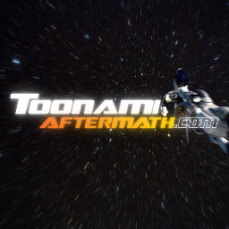
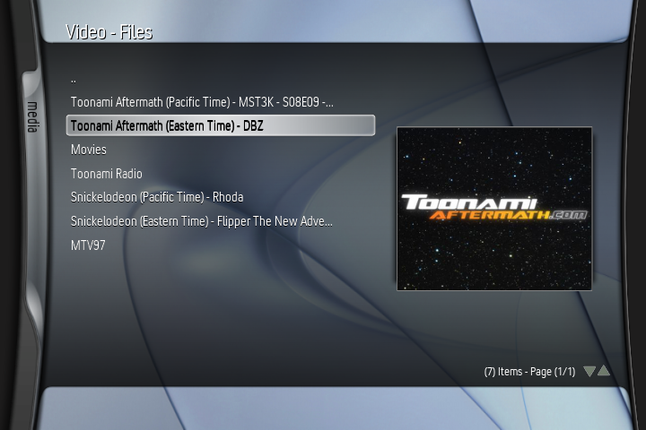
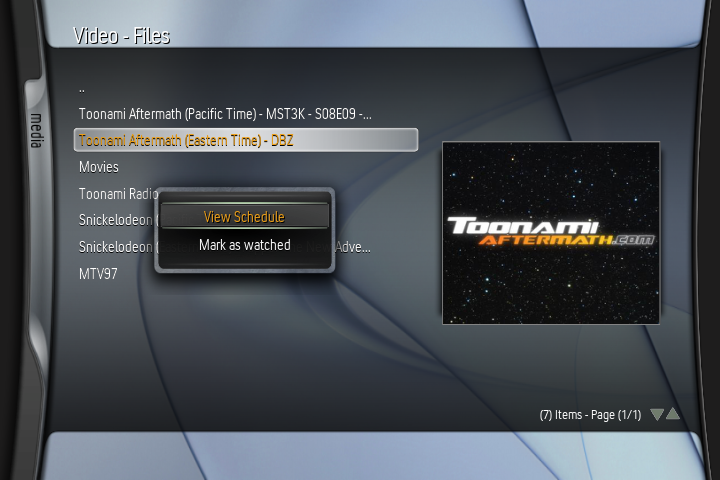
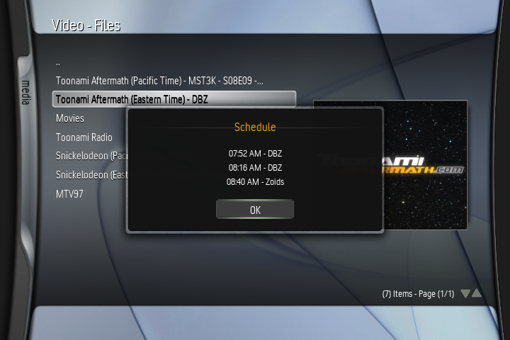

# ToonamiX
Toonami Aftermath add-on for XBMC4Xbox. Backported from the Kodi "TATV" addon.

# Features:
- All Toonami Aftermath channels available!
- View the schedule of your favourite channel via the context menu!

## How To Use:
- Download & extract the latest release file (if you'd like to test out the new schedule functions, the entire repository instead!)
- If outside of EST, modify your timezone in "default.py"
- Copy the "ToonamiX" folder to Q:/plugins/video

## Issues:
- 720p video resolution (not console resolution!) WILL crash your Xbox, so make sure videos are rendering at 480p in your settings! This isn't an add-on issue, this is a hardware issue.
- You tell me.

## TODO:
- Integrate chat as notifications(?)
- Improve timezone detection / modification

## Credits:
- Toon - for Toonami Aftermath + the TATV plugin!
